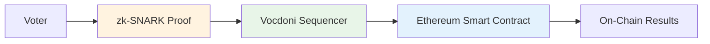

# Vocdoni DAVINCI SDK - Script Example

A comprehensive end-to-end demonstration of the Vocdoni DAVINCI SDK showcasing the complete privacy-preserving voting process using zero-knowledge proofs.

## Table of Contents

- [Overview](#overview)
- [Prerequisites](#prerequisites)
- [Installation](#installation)
- [Configuration](#configuration)
- [Usage](#usage)
- [What the Script Does](#what-the-script-does)
- [Process Flow](#process-flow)
- [Understanding the Output](#understanding-the-output)
- [Architecture](#architecture)
- [Troubleshooting](#troubleshooting)
- [Additional Resources](#additional-resources)

## Overview

This script demonstrates a complete voting workflow using the Vocdoni DAVINCI SDK, including:

- **Privacy-Preserving Voting**: Uses zk-SNARKs to ensure vote privacy while maintaining verifiability
- **Multi-Question Elections**: Creates an election with two questions (favorite color and transportation preference)
- **Smart Contract Integration**: Interacts with Ethereum smart contracts on Sepolia testnet
- **Complete Lifecycle**: From census creation to result tallying
- **Cryptographic Operations**: Handles encryption, proof generation, and verification

### Key Technologies

- **zk-SNARKs**: Zero-knowledge proofs for private voting
- **Ethereum**: Smart contract deployment and interaction
- **Vocdoni Sequencer**: Off-chain vote processing and aggregation
- **TypeScript**: Type-safe development environment

## Prerequisites

Before running this script, ensure you have:

### Software Requirements
- **Node.js** (v18 or higher)
- **Yarn** package manager
- **Git** for cloning repositories

### Blockchain Requirements
- **Ethereum Wallet** with a private key
- **Sepolia Testnet ETH** for transaction fees
- **RPC Provider** (Infura, Alchemy, or similar)

### API Access
- **Vocdoni API Endpoint** (development or production)

## Installation

1. **Clone the repository** (if not already done):
   ```bash
   git clone https://github.com/vocdoni/davinci-sdk.git
   cd davinci-sdk
   ```

2. **Install root dependencies and build**:
   ```bash
   yarn install && yarn build
   ```

3. **Navigate to the script example**:
   ```bash
   cd examples/script
   ```

4. **Install script dependencies**:
   ```bash
   yarn install
   ```

## Configuration

1. **Copy the environment template**:
   ```bash
   cp .env.example .env
   ```

2. **Configure environment variables** in `.env`:

   ```env
   # Sequencer API endpoint (e.g., http://localhost:8080)
   SEQUENCER_API_URL=

   # Census API endpoint (e.g., http://localhost:8081)
   CENSUS_API_URL=

   # Sepolia RPC endpoint (get from Infura, Alchemy, etc.)
   SEPOLIA_RPC=https://sepolia.infura.io/v3/YOUR_PROJECT_ID

   # Private key for transaction signing (without 0x prefix)
   PRIVATE_KEY=your_private_key_here

   # Optional: Custom contract addresses
   ORGANIZATION_REGISTRY_ADDRESS=
   PROCESS_REGISTRY_ADDRESS=

   # Force using contract addresses from sequencer info endpoint (default: false)
   FORCE_SEQUENCER_ADDRESSES=false
   ```

### Environment Variables Explained

| Variable | Description | Required | Example |
|----------|-------------|----------|---------|
| `SEQUENCER_API_URL` | Vocdoni sequencer API endpoint | ✅ | `https://sequencer1.davinci.vote` |
| `CENSUS_API_URL` | Vocdoni census API endpoint | ✅ | `https://census1.davinci.vote` |
| `SEPOLIA_RPC` | Ethereum Sepolia RPC URL | ✅ | `https://sepolia.infura.io/v3/...` |
| `PRIVATE_KEY` | Wallet private key (no 0x) | ✅ | `abcd1234...` |
| `ORGANIZATION_REGISTRY_ADDRESS` | Custom org registry address | ❌ | `0x1234...` |
| `PROCESS_REGISTRY_ADDRESS` | Custom process registry address | ❌ | `0x5678...` |
| `FORCE_SEQUENCER_ADDRESSES` | Use addresses from sequencer info | ❌ | `true` or `false` |

### New Feature: Force Sequencer Addresses

The script now includes a new environment variable `FORCE_SEQUENCER_ADDRESSES` that allows you to force the use of contract addresses from the sequencer's info endpoint instead of using environment variables or default addresses.

#### How it works:

1. **When `FORCE_SEQUENCER_ADDRESSES=false` (default)**:
   - The script will first check for `PROCESS_REGISTRY_ADDRESS` and `ORGANIZATION_REGISTRY_ADDRESS` in environment variables
   - If not found, it will fall back to the default deployed addresses

2. **When `FORCE_SEQUENCER_ADDRESSES=true`**:
   - The script will fetch contract addresses from the sequencer's `/info` endpoint
   - It will use the `process` and `organization` addresses from the sequencer response
   - If the sequencer doesn't provide valid addresses, the script will throw an error
   - Environment variables and default addresses are ignored when this flag is set

#### Benefits:

- **Dynamic Configuration**: Contract addresses are automatically retrieved from the sequencer
- **Environment Consistency**: Ensures the script uses the same contract addresses that the sequencer is configured to use
- **Reduced Configuration**: No need to manually specify contract addresses in environment variables

### Getting Required Values

#### Sepolia RPC URL
1. Sign up at [Infura](https://infura.io/) or [Alchemy](https://alchemy.com/)
2. Create a new project
3. Copy the Sepolia endpoint URL

#### Private Key
1. Export from MetaMask: Settings → Security & Privacy → Reveal Private Key
2. **⚠️ Security Warning**: Never share your private key or commit it to version control

#### Sepolia ETH
- Get free testnet ETH from [Sepolia Faucet](https://sepoliafaucet.com/)
- You'll need ~0.01 ETH for transaction fees

## Usage

Run the complete demonstration:

```bash
yarn start
```

The script will execute all 19 steps automatically, taking approximately 5-10 minutes to complete.

### Expected Output

The script provides detailed console output with:
- ✅ Success indicators for completed steps
- ℹ️ Information messages for ongoing processes
- 🚀 Progress indicators for major phases
- 📊 Final election results

When `FORCE_SEQUENCER_ADDRESSES=true`, you'll see output like:
```
ℹ FORCE_SEQUENCER_ADDRESSES is enabled - will use contract addresses from sequencer info endpoint
ℹ Using PROCESS_REGISTRY_ADDRESS from sequencer info: 0x1234...
ℹ Using ORGANIZATION_REGISTRY_ADDRESS from sequencer info: 0x5678...
```

When `FORCE_SEQUENCER_ADDRESSES=false`, you'll see:
```
ℹ FORCE_SEQUENCER_ADDRESSES is disabled - will use environment variables or default addresses
ℹ Using default process registry address: 0xabcd...
ℹ Using default organization registry address: 0xefgh...
```

## What the Script Does

The script performs a complete end-to-end voting process in 19 steps:

### Phase 1: API Setup & Census Creation (Steps 1-6)
1. **Ping API** - Verify connection to Vocdoni sequencer
2. **Fetch Info** - Get zk-circuit URLs and contract addresses
3. **Create Census** - Initialize a new voter registry
4. **Add Participants** - Register 10 test voters with weights
5. **Verify Participants** - Confirm all voters were added
6. **Fetch Census Root** - Get Merkle root and size

### Phase 2: Election Setup (Steps 7-10)
7. **Push Metadata** - Upload election information and questions
8. **Create Process** - Initialize voting process via sequencer
9. **Deploy On-Chain** - Register process on Ethereum
10. **Verify On-Chain** - Confirm smart contract state

### Phase 3: Vote Generation & Submission (Steps 11-17)
11. **Generate Proof Inputs** - Create zk-SNARK inputs for each voter
12. **Generate Proofs** - Compute zero-knowledge proofs
13. **Wait for Process** - Ensure voting is ready
14. **Submit Votes** - Send encrypted votes with proofs
15. **Check Vote Status** - Verify submission success
16. **Wait for Processing** - Allow votes to be settled
17. **Verify Votes** - Confirm all votes were recorded

### Phase 4: Results & Completion (Steps 18-19)
18. **End Process** - Close voting and trigger result calculation
19. **Show Results** - Display final tallied results

## Process Flow

```mermaid
graph TD
    A[Start Script] --> B[Setup API Connection]
    B --> C[Create Census]
    C --> D[Add 10 Test Participants]
    D --> E[Create Election Metadata]
    E --> F[Initialize Voting Process]
    F --> G[Deploy Smart Contract]
    G --> H[Generate zk-SNARK Proofs]
    H --> I[Submit Encrypted Votes]
    I --> J[Wait for Vote Processing]
    J --> K[End Voting Process]
    K --> L[Calculate & Display Results]
    L --> M[Complete ✅]

    style A fill:#e1f5fe
    style M fill:#c8e6c9
    style H fill:#fff3e0
    style I fill:#fff3e0
```



## Understanding the Output

### Console Output Sections

#### Step Progress
```
[Step 1] Ping the HTTP API
✔ API reachable

[Step 2] Fetch zk‐circuit & on‐chain contract info
   circuitUrl: https://...
   contracts: {...}
```

#### Vote Generation
```
   • 0x1234... votes:
     Q1: Blue (choice array: [0, 1, 0, 0])
     Q2: Car (choice array: [1, 0, 0, 0])
   • 0x1234... → voteId=0xabcd...
```

#### Final Results
```
Election Results:

Question 1: What is your favorite color?
Red (0):              2
Blue (1):             3
Green (2):            1
Yellow (3):           4

Question 2: What is your preferred transportation?
Car (0):              4
Bike (1):             2
Public Transport (2): 1
Walking (3):          3
```

### Key Metrics

- **Participants**: 10 test voters with weighted voting power
- **Questions**: 2 multiple-choice questions with 4 options each
- **Vote Privacy**: All votes are encrypted and use zero-knowledge proofs
- **Verification**: Every vote is cryptographically verified

## Architecture

### Zero-Knowledge Proof System

The script uses **zk-SNARKs** (Zero-Knowledge Succinct Non-Interactive Arguments of Knowledge) to ensure:

- **Privacy**: Vote choices remain secret
- **Integrity**: Votes cannot be tampered with
- **Verifiability**: Anyone can verify vote validity without seeing the content

### Smart Contract Integration



### Data Flow

1. **Census Creation**: Merkle tree of eligible voters
2. **Vote Encryption**: Votes encrypted with election public key
3. **Proof Generation**: zk-SNARK proves vote validity without revealing content
4. **Sequencer Processing**: Off-chain aggregation and verification
5. **On-Chain Settlement**: Final results published to Ethereum

## Troubleshooting

### Common Issues

#### "SEQUENCER_API_URL environment variable is required"
- **Cause**: Missing or empty `.env` file
- **Solution**: Copy `.env.example` to `.env` and configure variables

#### "insufficient funds for intrinsic transaction cost"
- **Cause**: Not enough Sepolia ETH for gas fees
- **Solution**: Get more testnet ETH from [Sepolia Faucet](https://sepoliafaucet.com/)

#### "Process not ready yet, checking again in 10 seconds..."
- **Cause**: Normal behavior - process initialization takes time
- **Solution**: Wait for the process to become ready (usually 30-60 seconds)

#### "Proof verification failed"
- **Cause**: zk-SNARK circuit or input issues
- **Solution**: Check API connectivity and try again

#### "Invalid process registry address from sequencer"
- **Cause**: `FORCE_SEQUENCER_ADDRESSES=true` but sequencer doesn't provide valid addresses
- **Solution**: 
  - Check sequencer configuration
  - Set `FORCE_SEQUENCER_ADDRESSES=false` to use environment variables or defaults
  - Manually set `PROCESS_REGISTRY_ADDRESS` and `ORGANIZATION_REGISTRY_ADDRESS`

#### Connection timeout errors
- **Cause**: Network issues or API downtime
- **Solution**:
  - Check internet connection
  - Verify SEQUENCER_API_URL and CENSUS_API_URL are correct
  - Try again later if API is down

### Debug Tips

1. **Enable verbose logging**: The script already provides detailed output
2. **Check transaction status**: Use [Sepolia Etherscan](https://sepolia.etherscan.io/) to verify transactions
3. **Verify API status**: Test API connectivity with `curl $SEQUENCER_API_URL/ping`
4. **Check balances**: Ensure wallet has sufficient Sepolia ETH

### Getting Help

If you encounter issues:

1. Check the [troubleshooting section](#troubleshooting) above
2. Review the console output for specific error messages
3. Verify all prerequisites are met
4. Check the [Vocdoni documentation](https://docs.vocdoni.io/)

## Additional Resources

### Documentation
- [Vocdoni Documentation](https://docs.vocdoni.io/)
- [DaVinci SDK Documentation](https://github.com/vocdoni/davinci-sdk)
- [API Documentation](https://github.com/vocdoni/davinci-node/tree/main/api)
- [Protocol Documentation](https://whitepaper.vocdoni.io)
- [Smart Contract Documentation](https://github.com/vocdoni/davinci-contracts)

### Community
- [Discord](https://chat.vocdoni.io)
- [Telegram](https://t.me/vocdoni_community)
- [Twitter](https://twitter.com/vocdoni)
- [Website](https://vocdoni.io)

### Related Examples
- [UI Example](../ui/) - Web interface for the voting system
- [Integration Tests](../../test/) - Additional SDK usage examples

### Technical Resources
- [zk-SNARKs Explained](https://z.cash/technology/zksnarks/)
- [Ethereum Development](https://ethereum.org/developers/)
- [Vocdoni Whitepaper](https://whitepaper.vocdoni.io)

### Support

For issues and questions:
- Check the [GitHub Issues](https://github.com/vocdoni/davinci-sdk/issues)
- Join the [Vocdoni Discord](https://chat.vocdoni.io)
- Join our [Telegram](https://t.me/vocdoni_community)
- Follow us on [Twitter](https://twitter.com/vocdoni)
- Read the [Vocdoni Documentation](https://docs.vocdoni.io/)
- Visit our [Website](https://vocdoni.io)

For enterprise support and custom integrations, contact us at [info@vocdoni.io](mailto:info@vocdoni.io).

---

**Note**: This is a demonstration script for development and testing purposes. For production use, implement proper error handling, security measures, and user interface components.
